# Geo Dashboard - Database Analysis

## 1. Database Entity-Relationship (ER) Model
The application database manages a structured 3-level geography hierarchy and links it to users, BDM assignments, leads, deals, and onboarded partner profiles.

```mermaid
erDiagram
    DIVISIONS {
        bigint id PK
        string name
        string code UK
        text description
        boolean is_active
        bigint created_by FK
        timestamps timestamps
    }
    TERRITORIES {
        bigint id PK
        bigint division_id FK
        string name
        string code UK
        text description
        json boundaries
        boolean is_active
        bigint created_by FK
        timestamps timestamps
    }
    LOCALITIES {
        bigint id PK
        bigint territory_id FK
        string name
        string code UK
        text description
        json polygon
        json geo_data
        boolean is_active
        bigint created_by FK
        timestamps timestamps
    }
    USERS {
        bigint id PK
        string name
        string email UK
        string password
        string phone
        boolean is_active
        timestamp email_verified_at
        timestamps timestamps
    }
    TERRITORY_BDM_ASSIGNMENTS {
        bigint id PK
        bigint territory_id FK
        bigint user_id FK
        timestamp assigned_at
        bigint assigned_by FK
        boolean is_active
    }
    LEADS {
        bigint id PK
        string title
        string contact_name
        string contact_email
        string contact_mobile
        text address
        decimal latitude
        decimal longitude
        bigint locality_id FK
        bigint territory_id FK
        bigint division_id FK
        bigint assigned_bdm_id FK
        string source
        enum status
        enum priority
        boolean is_mapped
        bigint created_by FK
        string company_name
        string industry
        string company_size
        string website
        string job_title
        string alternate_mobile
        string linkedin_url
        decimal estimated_deal_value
        string preferred_contact_method
        string utm_source
        string utm_medium
        string utm_campaign
        timestamps timestamps
    }
    DEALS {
        bigint id PK
        bigint lead_id FK
        string title
        text description
        decimal value
        enum status
        bigint assigned_bdm_id FK
        bigint territory_id FK
        string verification_status
        string approval_status
        bigint approved_by FK
        timestamp approved_at
        text notes
        bigint created_by FK
        timestamps timestamps
    }
    PARTNERS {
        bigint id PK
        bigint user_id FK
        bigint deal_id FK
        enum partner_type
        string business_name
        text business_address
        decimal latitude
        decimal longitude
        bigint locality_id FK
        bigint territory_id FK
        string contact_name
        string contact_email
        string contact_mobile
        enum status
        timestamp onboarded_at
        bigint created_by FK
        tinyint experience_years
        string previous_employer
        text experience_description
        string education_level
        string education_institution
        string education_field
        json preferred_territory_ids
        string gst_number
        string business_type
        string annual_turnover
        json product_categories
        json services_offered
        boolean has_driving_license
        string driving_license_number
        string license_type
        string vehicle_type
        string vehicle_registration
        datetime appointment_datetime
        text appointment_notes
        string registration_source
        string utm_source
        string utm_medium
        string utm_campaign
        timestamps timestamps
    }
    PARTNER_SERVICE_COVERAGE_LOCALITIES {
        bigint id PK
        bigint partner_id FK
        bigint locality_id FK
        boolean is_active
        timestamps timestamps
    }

    DIVISIONS ||--o{ TERRITORIES : "contains"
    TERRITORIES ||--o{ LOCALITIES : "contains"
    TERRITORIES ||--o{ TERRITORY_BDM_ASSIGNMENTS : "has assignment"
    USERS ||--o{ TERRITORY_BDM_ASSIGNMENTS : "is assigned as BDM"
    LOCALITIES ||--o{ LEADS : "is mapped to"
    TERRITORIES ||--o{ LEADS : "is mapped to"
    DIVISIONS ||--o{ LEADS : "is mapped to"
    USERS ||--o{ LEADS : "is assigned BDM of"
    LEADS ||--|| DEALS : "converts to"
    DEALS ||--o{ PARTNERS : "creates profile"
    USERS ||--o{ PARTNERS : "has login account"
    LOCALITIES ||--o{ PARTNERS : "primary locality"
    TERRITORIES ||--o{ PARTNERS : "primary territory"
    PARTNERS ||--o{ PARTNER_SERVICE_COVERAGE_LOCALITIES : "covers service areas"
    LOCALITIES ||--o{ PARTNER_SERVICE_COVERAGE_LOCALITIES : "is covered service area"
```

## 2. Table Schemas, Indexes, and Constraints

### `divisions`
* **Primary Key**: `id`
* **Foreign Keys**: `created_by` references `users(id)`
* **Indexes**: `code` (unique), `is_active`

### `territories`
* **Primary Key**: `id`
* **Foreign Keys**: 
  * `division_id` references `divisions(id)` (ON DELETE CASCADE)
  * `created_by` references `users(id)` (ON DELETE SET NULL)
* **Indexes**: `division_id`, `code` (unique), `is_active`

### `localities`
* **Primary Key**: `id`
* **Foreign Keys**:
  * `territory_id` references `territories(id)` (ON DELETE CASCADE)
  * `created_by` references `users(id)` (ON DELETE SET NULL)
* **Indexes**: `territory_id`, `code` (unique), `is_active`

### `territory_bdm_assignments`
* **Primary Key**: `id`
* **Foreign Keys**:
  * `territory_id` references `territories(id)` (ON DELETE CASCADE)
  * `user_id` references `users(id)` (ON DELETE CASCADE)
  * `assigned_by` references `users(id)` (ON DELETE SET NULL)
* **Constraints**: Unique constraint on `['territory_id', 'is_active']` ensures a territory can only have one active BDM at a time.

### `leads`
* **Primary Key**: `id`
* **Foreign Keys**:
  * `locality_id` references `localities(id)` (ON DELETE SET NULL)
  * `territory_id` references `territories(id)` (ON DELETE SET NULL)
  * `division_id` references `divisions(id)` (ON DELETE SET NULL)
  * `assigned_bdm_id` references `users(id)` (ON DELETE SET NULL)
  * `created_by` references `users(id)` (ON DELETE SET NULL)
* **Indexes**: `status`, `priority`, `assigned_bdm_id`, `territory_id`, `locality_id`, `contact_mobile`, `contact_email`, `is_mapped`

### `deals`
* **Primary Key**: `id`
* **Foreign Keys**:
  * `lead_id` references `leads(id)` (ON DELETE CASCADE)
  * `assigned_bdm_id` references `users(id)` (ON DELETE SET NULL)
  * `territory_id` references `territories(id)` (ON DELETE SET NULL)
  * `approved_by` references `users(id)` (ON DELETE SET NULL)
  * `created_by` references `users(id)` (ON DELETE SET NULL)
* **Indexes**: `status`, `lead_id`, `assigned_bdm_id`, `territory_id`

### `partners`
* **Primary Key**: `id`
* **Foreign Keys**:
  * `user_id` references `users(id)` (ON DELETE SET NULL)
  * `deal_id` references `deals(id)` (ON DELETE SET NULL)
  * `locality_id` references `localities(id)` (ON DELETE SET NULL)
  * `territory_id` references `territories(id)` (ON DELETE SET NULL)
  * `created_by` references `users(id)` (ON DELETE SET NULL)
* **Indexes**: `partner_type`, `status`, `territory_id`, `locality_id`, `user_id`, `registration_source`, `appointment_datetime`

### `partner_service_coverage_localities`
* **Primary Key**: `id`
* **Foreign Keys**:
  * `partner_id` references `partners(id)` (ON DELETE CASCADE)
  * `locality_id` references `localities(id)` (ON DELETE CASCADE)
* **Constraints**: Unique constraint `['partner_id', 'locality_id']` prevents duplicate service coverage mapping.
